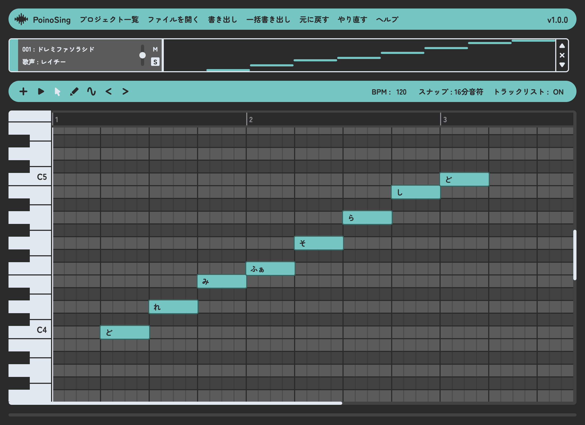

# PoinoSing


なかの人がいない歌唱音声合成ソフト  

## ブラウザで使う
PoinoSing 最新版  
https://koharuyuzuki.github.io/poinosing/latest/  

PoinoSing バージョン一覧  
https://koharuyuzuki.github.io/poinosing/versions/  

## Q&A
Q&A.txt をご参照ください  

## ビルド
```
$ bun install
$ bun run build
```

## ライセンス
PoinoSing v1.0.0は、PoinoTalk Licence 1.0 が適用されます  
詳細は LICENSE ファイルをご参照ください  
不明な点についてはライセンスQ&Aをご参照ください  

ライセンスQ&A  
https://github.com/KoharuYuzuki/PoinoTalkLicence?tab=readme-ov-file#qa  

### 注意事項
- screenshot.png は PoinoTalk Licence 1.0 の対象外です
- screenshot.png には Open Font License の Zen Maru Gothic フォントを使用しています

## サードパーティーライセンス
`build/*` には ThirdPartyNotices.txt に記載されたマテリアルが一部含まれています  
